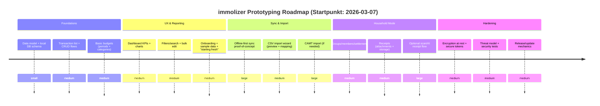

# Open-Source Personal-Finance- und Haushaltsbudget-Apps sowie UI-Design-Templates als Grundlage für immolizer

## Executive Summary

Für immolizer sind aktuell drei Open-Source-„Leitplanken“ besonders wertvoll: **lokal-first Envelope-Budgeting** (citeturn26view0turn14view0), **self-hosted Finanz- und Transaktionsverwaltung mit Import-Pipeline** (citeturn15view0turn4search0turn31view2) und **haushalts-/gruppenfähige Split-Budgets** (citeturn34view1turn34view0turn35view0). In der Praxis bedeutet das: immolizer sollte ein **lokales Datenmodell + Offline-UX** als Primärmodus haben (schnell, privat, robust), und Sync/Import als optionales Modul (citeturn26view0turn29view0turn28view1).

Wenn immolizer **nicht Open Source** werden soll, ist die **Lizenz-Frage** ein harter Filter: **MIT/BSD**-Repos sind für direktes Code-Reuse meist kompatibel; **GPL/AGPL**-Code kann eure Distribution „anstecken“ (Copyleft), sodass direkte Übernahme einzelner Module schnell zum Lizenzproblem wird. In dem Set hier sind deshalb **Actual (MIT)** und **Spliit (MIT)** die zwei klarsten Kandidaten für „Code als Inspirator + ggf. Komponenten übernehmen“, während **Firefly III (AGPL)** eher als „Referenzsystem“ (Architektur/Features/API) oder als **separat betriebener Dienst** sinnvoll ist (citeturn15view0turn14view0turn34view1).

Designseitig liefern **Dribbble** (Breite an Fintech-/Budget-UI-Patterns) und **Figma-Templates** (Dashboard-/Komponenten-Bibliotheken) schnell Inspiration für Informationsarchitektur, Cards/Charts und Onboarding. Gleichzeitig zeigen echte Open-Source-Apps wie **Waterfly III** (Material 3, Charts, Filter, Attachments) oder **Ivy Wallet** (Compose, Design-System-Denke) sehr konkrete Interaktionsmuster, die in Produktion funktionieren (citeturn24view1turn35view1turn34view1).

## Relevante Open-Source-Repositories

### Vergleichstabelle der wichtigsten Repos

| Repo (Link) | Plattform | Haupt-Stack | Lizenz | Aktivität (Stars/Forks, zuletzt) | Kurz-Fit für immolizer |
|---|---|---|---|---|---|
| actualbudget/actual. citeturn14view0turn12search1 | Web + Desktop (Monorepo) | Node.js + TypeScript, Yarn Workspaces; Core in loot-core citeturn29view0turn29view1 | MIT citeturn14view0 | ~25k ★ / ~2.2k Forks; Update 2026-03-06 citeturn14view0 | **Top**: lokal-first Budgeting + Sync-Architektur als Blaupause |
| spliit-app/spliit. citeturn34view1turn3search34 | Web (PWA) | Next.js + Tailwind + shadcn/ui + Prisma citeturn34view1 | MIT citeturn34view1 | ~2.6k ★ / ~396 Forks citeturn3search34turn34view1 | **Top**: Haushalts-/Gruppen-Splitting, schnelle UI-Patterns, MIT |
| firefly-iii/firefly-iii. citeturn15view0turn4search1 | Web (self-hosted) | PHP/Laravel-Ökosystem (implizit), Docker-first citeturn31view2 | AGPLv3 citeturn15view0 | ~23k ★ / ~2.1k Forks; Update 2026-03-07 citeturn15view0 | **Referenz**: Feature-Tiefe, Datenmodell, Reports; Code-Reuse heikel (AGPL) |
| we-promise/sure. citeturn32view0turn33view0 | Web (self-hosted) | Ruby on Rails + Postgres + Redis; OpenAPI via rswag citeturn33view0 | AGPLv3 citeturn32view0 | ~7.1k ★ / ~753 Forks citeturn32view0 | **Bridge**: Wealth-/PFM-App als „großes Referenzprodukt“; Copyleft |
| spiral-project/ihatemoney. citeturn34view0turn3search13 | Web (self-hosted) | Python (3.11–3.13), mehrere DB-Backends; docker-compose vorhanden citeturn34view0 | “BSD beerware derivative” (Projektbeschreibung) citeturn34view0 | ~1.3k ★ / ~287 Forks citeturn3search13 | Sehr gutes Minimal-UX für Shared Budgets; eher „simplicity first“ |
| moneymanagerex/moneymanagerex. citeturn16view0turn12search26 | Desktop | C++/wxWidgets; Fokus auf Einfachheit citeturn12search26 | GPL-2.0 citeturn16view0 | ~2.2k ★ / ~333 Forks; Update 2026-03-07 citeturn16view0 | Referenz für Desktop-IA, Buchungs-/Kontenlogik; Code-Reuse schwierig |
| moneymanagerex/android-money-manager-ex. citeturn16view0 | Mobile (Android) | Java; „local-first“, „encrypted“, „self-hosted“, „sync“ citeturn16view0 | GPL-3.0 citeturn16view0 | ~647 ★ / ~216 Forks; Update 2026-03-07 citeturn16view0 | Referenz für Mobile + Verschlüsselung/Sync-Konzept |
| KDE/kmymoney. citeturn12search8turn12search5 | Desktop | C++/Qt (KDE-Familie) citeturn12search8 | (Lizenz nicht im Ausschnitt) | Aktiv gepflegt (Release-News 2026-02-22) citeturn12search5 | Sehr gute Referenz für „Accounting-Grade“ Kategorien/Reports |
| Ivy-Apps/ivy-wallet. citeturn35view1turn1search34 | Mobile (Android) | Kotlin + Jetpack Compose; starkes UI/Design-System citeturn35view1turn6view2 | GPL-3.0 citeturn35view1 | (nicht mehr maintained seit 2024-11-05) citeturn35view1 | **UI/UX-Gold** für Mobile; aber Maintenance-Ende + GPL |
| dreautall/waterfly-iii. citeturn24view1 | Mobile (Flutter) | Flutter + Material 3; Charts/Filters/Attachments citeturn24view1 | MIT citeturn24view1 | ~621 ★ / ~52 Forks; Release 2026-01-10 citeturn24view1 | Sehr brauchbare Mobile-UX-Patterns + MIT |
| victorbalssa/abacus. citeturn17view0turn23view0 | Mobile (RN/Expo) | Expo + React Navigation + Rematch; Charting (victory-native) citeturn17view0turn23view0 | GPL-3.0 citeturn17view0 | ~802 ★ / 70 Forks; Release 2026-02-09 citeturn17view0 | Super Referenz für Auth + Secure Storage + Transaktionslisten |
| jameskokoska/Cashew. citeturn11search3turn36view0 | Mobile + Web (PWA) | Flutter + Drift + Firebase; Sync/Backup/Lock citeturn36view0turn36view1 | (Lizenz nicht im Ausschnitt) | Sehr starke Feature-Breite, gute UI/Charts; als Referenz top |
| eneiluj/moneybuster. citeturn35view0turn34view2 | Mobile (Android) | Android Studio Build; Sync mit IHateMoney/Cospend citeturn35view0 | GPLv3 citeturn34view2turn35view0 | 1,060 Commits (GitLab) citeturn34view2 | Gute Haushalts-/Gruppen-UX + „choose your backend“ |
| igi0/openmoneybox. citeturn34view3turn4search14 | Mobile (Android) | (Android-App) SQLCipher erwähnt citeturn4search14 | GPLv3-only citeturn4search14turn34view3 | 293 Commits, Releases/Tags (GitLab) citeturn34view3 | Interessant für „simple budgets“, plus SQLCipher-Integration |

### Detailnotizen pro Repo (Architektur, Build/Run, Eignung)

**actualbudget/actual (MIT)** – lokales Datenmodell + Sync als Kernidee. „Local-first“ mit Synchronisationskomponente und monorepo-basierter Paketstruktur (loot-core als plattformagnostischer Kern) (citeturn26view0turn29view1turn11search1).  
Build/Run (Dev): Node.js ≥22, Yarn ≥4.9.1; `git clone`, `yarn install`, `yarn start`/`yarn start:server-dev` etc. (citeturn29view0).  
Run (Self-host): Docker Compose (`docker compose up --detach`) oder `docker run ... -p 5006:5006 -v ...:/data` (citeturn28view1turn26view0).  
Integration: Für immolizer ist das **die beste Referenz** für **Offline-First UX**, Datenmodell, Sync-Mechaniken und „progressive disclosure“ in UI-Strategie (citeturn27view0). Wichtig: es gab **2026-03-02** einen Release mit **Security-Fix** für Sync-Server; Updates sind nicht optional (citeturn12search13turn11search5).

**spliit-app/spliit (MIT)** – „Splitwise“-Alternative, sehr direkt auf Haushalts-/Freundesgruppen. Stack: Next.js, TailwindCSS, shadcn/ui, Prisma; Hosting/DB auf Vercel erwähnt (citeturn34view1).  
Run lokal: PostgreSQL starten, `.env.example` → `.env`, `npm install`, `npm run dev` (citeturn34view1). Container-Run via npm-Skripte + Compose (citeturn34view1).  
Integration: Ideal für immolizer, wenn ihr **gemeinsame Haushaltskasse**, **Belege**, **Kategorien** und **Balances/Reimbursements** als Modul braucht. Plus: Health-Endpoints (`/api/health/*`) als Produktionspattern (citeturn34view1).

**firefly-iii/firefly-iii (AGPLv3)** – großes self-hosted Personal-Finance-System mit Budgets/Kategorien/Tags und Reports (citeturn4search1turn15view0).  
Ökosystem-Repo **firefly-iii/data-importer** trennt Import aus Sicherheits-/Maintenance-Gründen ab; Import u. a. via CSV sowie CAMT.052/.053 (citeturn4search0turn15view0).  
Deployment: Das GitHub-Repo **firefly-iii/docker** liefert docker-compose-Dateien für Firefly III + MariaDB/MySQL sowie optional den Importer; außerdem klare Tag-Strategie (`fireflyiii/core:latest`, `develop`, etc.) (citeturn31view2).  
Integration: Als **Referenz** top (Datenmodell/Reports/Importer), als „Code zum Ausschneiden“ wegen **AGPL** riskant. Sauberer Ansatz: immolizer hält eigene Codebase, kann aber optional **an eine Firefly-III-Instanz** via API andocken (API-Dokumentation existiert im Ökosystem) (citeturn5search7turn5search3).

**we-promise/sure (AGPLv3, Fork von Maybe)** – community-maintained Nachfolger eines aufgegebenen Produkts; explizit als Fork positioniert (citeturn6view0turn32view0).  
Architektur/Build: Rails MVC, JS in `app/javascript`, Assets in `app/assets` (Tailwind etc.); Setup über `.env.local` + `bin/setup`, Run via `bin/dev`; Security-Scan via `bin/brakeman`. Zusätzlich OpenAPI-Doku über rswag (spec-only) (citeturn33view0).  
Integration: Sehr guter „Blueprint“ für **große** PFM-Apps (Daten-heavy, Provider-Metadaten, Pending-Flags etc.) – aber Copyleft. Als Referenz für API-Design + Provider-Metadaten-Strategie extrem nützlich (citeturn33view0).

**spiral-project/ihatemoney** – shared budget manager, bewusst simpel; Maintainer sprechen selbst von „maintenance mode“/Simplicity als Ziel und nennen Alternativen wie Cospend/Spliit (citeturn34view0).  
Requirements: Python 3.11–3.13; Backends u. a. SQLite/PostgreSQL/MariaDB; docker-compose vorhanden (citeturn34view0).  
Integration: Sehr gute Referenz für **friktionsarmes Teilen ohne „Account-Wahn“** und für schnelle „Settle up“-Workflows.

**moneymanagerex (Desktop) & android-money-manager-ex** – aktives Open-Source-Ökosystem; Desktop: C++/wxWidgets, Android: Java. Der Android-Client beschreibt sich als „Local-first… Encrypted… self-hosted… sync across devices“ (citeturn16view0).  
Deutschsprachige Doku: Es gibt ein deutsches Benutzerhandbuch (citeturn12search19).  
Integration: Für immolizer als Referenz für **klassische Konten-/Cashflow-Navigation**, **Reports** und „langjährig gewachsene“ UX brauchbar. Direkter Code-Reuse wegen GPL eher nicht.

**KDE/kmymoney** – Desktop-PFM aus KDE-Familie, C++/Qt, Multi-Plattform (citeturn12search8). Aktuelle Release-Kommunikation (z. B. 5.2.2, 2026-02-22) zeigt laufende Pflege (citeturn12search5).  
Integration: Referenz für „Accounting-Grade“ Kategorien, Salden, Reports; für immolizer besonders dann spannend, wenn ihr **Immobilienobjekte/Unterkonten** als echte Buchungseinheiten führen wollt (Strukturvorbild).

**Ivy Wallet (GPL-3.0; Maintenance Ende 2024-11-05)** – trotz Maintenance-Ende ein starker Architektur-/UI-Lehrmeister: Kotlin + Jetpack Compose, Material3, modulare Architektur + ADRs, Design-System-Verweis („Ivy design system“ in Figma erwähnt) (citeturn6view2turn35view1).  
Build/Run: Java 17+, aktuelles Android Studio; Setup über Fork/Clone, dann IDE-Build (Details/Guidelines im Repo) (citeturn35view1).  
Integration: **UI/UX-Inspiration** (Compose-Patterns, Komponenten-Organisation) – nicht als „Basiscode“ wegen GPL + Maintenance-Ende.

**Waterfly III (MIT)** – Flutter-Client, klar an Material 3 orientiert; liefert sehr konkrete Screenshots und Patterns: Dashboard-Charts, Filter, Split-Transactions, Attachments, Budget-Übersicht etc. (citeturn24view1turn25view0).  
Build/Run: Standard Flutter: `flutter pub get`, `flutter run` (implizit; Repo ist Flutter-basiert) (citeturn24view1).  
Integration: **Sehr gut** für immolizer, wenn ihr Flutter evaluiert oder Mobile-UX schnell prototypen wollt – und MIT macht Reuse realistischer.

**Abacus (GPL-3.0)** – Expo/React-Native Client; zeigt moderne Mobile-Patterns: Routing via React Navigation, Store via Rematch; verwendet u. a. `victory-native` (Charts) und `react-native-swipe-list-view` (Swipe-Actions) (citeturn17view0turn23view0turn11search6).  
Security: Tokens in iOS Keychain; auf Android in verschlüsselten SharedPreferences via Keystore; ausdrücklich keine Analytics/Crashlytics (citeturn17view0).  
Run: `npm run start` (Expo dev-client), `npm run ios` / `npm run android` (citeturn23view0).  
Integration: **Sehr wertvoll** als Referenz für „Auth + Secure Storage + Charts + Transaction List UX“. Direktes Code-Reuse wegen GPL abhängig von eurer Lizenzstrategie.

**Cashew (Flutter + Drift + Firebase)** – feature-reiche Budget/Expense-App inkl. Multi-Currency/Accounts, Sync/Backup, Biometric Lock, PWA; ausdrücklich Flutter + Drift + Firebase (citeturn36view0turn36view1turn11search3).  
Spannend für immolizer: „App Links“/Deep-Link-Automation zum Erstellen von Transactions (z. B. `/addTransaction`), plus CSV-/Sheets-Import (citeturn36view2turn36view1).  
Integration: Als „Feature-Katalog“ und UX-Referenz top; für einen sauber lizenzierten Reuse braucht ihr die Lizenzprüfung im Repo (im Ausschnitt nicht enthalten).

**MoneyBuster (GPLv3)** – Android-Client für **IHateMoney** und **Nextcloud Cospend**, bewusst „choose where your data goes“ (Privacy) (citeturn35view0turn5search0).  
Build: `git clone --recurse-submodules ...`, dann in Android Studio öffnen und bauen (citeturn35view0).  
Integration: Sehr direkt für Haushalt/Mehrparteien + Backend-Wahl; als Pattern-Referenz super.

**OpenMoneyBox (GPLv3)** – einfache Budget-App; F-Droid Changelog erwähnt SQLCipher und AndroidChart, was für „Offline + verschlüsselte DB“ interessant ist (citeturn4search14). GitLab zeigt Releases/Tags als Indikator für langfristige Pflege (citeturn34view3).  
Integration: Architekturidee „lightweight budgets“ + Verschlüsselung (SQLCipher) als Baustein.

## Visual Design Ressourcen und Templates

### Praktische Inspirationsquellen

**Dribbble-Sammlungen** – sehr breite Gallery für moderne „Expense Tracker“/„Personal Finance“/„Budget App“-UI, gut für Card-Layouts, Chart-Visualisierung, Onboarding, „daily spend“ Widgets und Dark Mode-Varianten. Einstieg über die Such-/Tag-Seiten (citeturn7search2turn7search3turn7search11).

image_group{"layout":"carousel","aspect_ratio":"16:9","query":["expense tracker app ui dribbble","personal finance dashboard mobile ui","budget app onboarding ui","finance dashboard web ui"]}

**Figma Dashboard Templates (offiziell)** – Figma bündelt Dashboard-Templates und „Daily expenses monitoring dashboard“-Inspiration; nützlich für Web-IA, Sidebar/Topnav, KPI-Cards, Charts und Tabellenkomponenten (citeturn9search24).

**Kostenlose Figma-Template-Teaser über Behance** – ein Beispiel: „Fintech Dashboard (FREE Figma template)“ als visuelle Referenz (inkl. Duplikationshinweis) (citeturn8search29). Das ist nicht automatisch eine „Figma Community File“, aber es ist ein realer Design-Startpunkt.

**UI-Kit-Aggregatoren (mit Vorsicht)** – Seiten wie FigmaElements („Fintech Figma UI Kits“) oder UIDux („Finance Dashboard App UI“) sind gute „Indexe“, aber Lizenz/Verwendungsrechte müssen sauber geprüft werden, weil viele Assets Premium sind oder unklare Rechteketten haben (citeturn8search21turn8search32).

**Material 3 / Material You als Design-System** – besonders relevant, wenn immolizer Mobile-first ist. Waterfly III orientiert sich explizit an Material 3 und zeigt, wie Charts/Listen/Filter in Material-Optik funktionieren (citeturn24view1). Cashew betont Material-You-Design und Anpassbarkeit (Accent Color, Light/Dark) (citeturn36view1).

**„Minimal, aber progressive disclosure“ als Produktphilosophie** – Actuals Doku beschreibt explizit eine minimalistische UI, die fortgeschrittene Funktionen schrittweise sichtbar macht (citeturn27view0). Das ist für immolizer (Haushalt + ggf. Immobilienkontext) ein starkes Gegenmittel gegen überladene „Fintech-Dashboards“.

### Vergleichstabelle Design-Templates/Quellen

| Quelle | Artefakt-Typ | Stärke | Typische Einsatzstelle in immolizer | Lizenz-/Reuse-Risiko |
|---|---|---|---|---|
| Dribbble Search/Tags. citeturn7search2turn7search7 | Inspiration/Screens: Mobile + Web | Breite Muster: Charts, Cards, Onboarding, Dark Mode | Look&Feel, Layout-Varianten, Microinteractions | Hoch: Bilder sind nicht automatisch „reuse-frei“ |
| Figma Dashboard Templates (offiziell). citeturn9search24 | Templates/Komponenten-Cluster | Wiederverwendbare Dashboard-Strukturen, Charts, Widgets | Web-Dashboard, Admin/Power-User Ansichten | Mittel: abhängig vom konkreten Template |
| Behance „Fintech Dashboard (FREE Figma template)“. citeturn8search29 | Free Template-Showcase | Konkretes Dashboard-Layout | Web-Reports, KPI-Übersicht | Mittel: Rechte checken |
| UIDux Finance Dashboard App UI. citeturn8search32 | UI-Kit (Premium/Index) | Schnelle „fertige“ UI-Bausteine | Prototyping/Exploration | Mittel–hoch: Premium/Stock-Assets/Hinweise zu Copyright im Template |
| Waterfly III Screenshots (Repo). citeturn24view1 | Real App Screens | Praxisnah, implementierbar (Material 3), echte States | Transaktionsliste, Filter, Attachments, Charts | Niedriger (MIT-Codebase) – Screens trotzdem nicht 1:1 kopieren |
| Ivy Wallet Screens/Design-System-Referenzen. citeturn35view1turn6view2 | Real App + Design-System-Denke | Sehr gutes Mobile-UI-Handwerk (Compose) | Mobile UI-Komponentenbibliothek | Mittel: GPL + Figma-Designsystem-Link nicht direkt nutzbar ohne Rechte |

**Hinweis zu Figma Community Files:** Direkte Community-File-Seiten sind über das verwendete Recherche-Interface technisch blockiert. Deshalb sind oben entweder **offizielle Figma-Template-Hubs** oder **öffentlich zugängliche Index-/Showcase-Seiten** enthalten (citeturn9search24turn8search29turn8search21). Für eure interne Arbeit: in entity["company","Figma","design collaboration tool"] gezielt nach „budget tracker“, „expense tracker“, „finance dashboard“ in *Community → Files* suchen (manuell im Browser).

## UI/UX-Patterns und Mapping auf Implementierungsbausteine

### Pattern-Mapping-Tabelle

| UI/UX-Pattern | Konkrete Komponenten in immolizer | Referenz-Repos, die das Pattern gut zeigen | Implementierungsnotizen (Libraries/Frameworks) |
|---|---|---|---|
| Transaktionsliste (chronologisch) | Virtualized List, Gruppierung nach Datum, Sticky Headers, Swipe-Actions, „Quick add“ | Waterfly III (Filter/Listen/Attachments). citeturn24view1 Abacus nutzt Swipe und Charting libs. citeturn23view0turn11search6 | Mobile: Flutter `ListView`/`SliverList`; RN: `FlashList`/`FlatList`, Swipe-Lib (Abacus nutzt `react-native-swipe-list-view`). citeturn23view0 |
| Budget-Envelope/Perioden | Budget-Period Selector, Kategorien-Limits, „available“ vs „spent“, Rollovers | Actual („Envelope budgeting“, lokal-first). citeturn26view0turn29view1 Cashew (Custom time periods, category limits). citeturn36view1 | Web: Tabellen-/Grid-UI mit Inline-Editing; lokale Berechnungen im „core“-Package (Analog zu loot-core). citeturn29view1 |
| Dashboard & Reports | KPI-Cards, Trend-Charts, Kategorie-Pies, Cashflow, Waterfall | Waterfly III (mehrere Charts, Budget Overview). citeturn24view1 Actual Reports werden aktiv weiterentwickelt. citeturn12search13 | Web: Chart-Libraries (ApexCharts/ECharts/Recharts je nach Stack). Mobile: Flutter Charts; RN: `victory-native` ist praxiserprobt (Abacus). citeturn23view0 |
| Import & Normalisierung | CSV-Import, CAMT-Import, Mapping UI, Duplicate Detection | Firefly III Data Importer (CSV, CAMT.052/053; getrennt aus Security-Gründen). citeturn4search0 Cashew: CSV/Sheets Import. citeturn36view2 | Pipeline: Parser → Normalizer → Categorizer → Merge/Dedupe. UI: „Mapping Wizard“ + Preview. |
| Haushalts-/Gruppenbudget | Gruppen, Teilnehmer, Balances, Reimbursements, Beleg-Upload/Scan | Spliit Features + Local/Container run docs. citeturn34view1 MoneyBuster (Projects/Members/Bills + QR Share). citeturn35view0 IHateMoney (shared budget, settle bills). citeturn34view0 | Datenmodell: Group → Members → Expenses → Settlement. Optional: Receipt OCR/AI (Spliit erwähnt receipt scan Feature). citeturn34view1 |
| Auth & Sync | OIDC/OAuth2, API Keys, Offline Sync, Multi-Device | Actual: Sync-Server + Security-Fix kommuniziert. citeturn12search13turn28view1 Abacus: OAuth2 + sichere Token-Speicherung. citeturn17view0 Sure: API key pattern + OpenAPI docs. citeturn33view0 | Empfehlung: lokal-first + optionaler Sync-Service. Tokens/Secrets nie in Klartext speichern (Keychain/Keystore). citeturn17view0 |
| Onboarding/„Starting Fresh“ | Setup-Wizard, Demo-Daten, Import-Optionen, Privatsphäre-Hinweise | Actual hat „Starting Fresh“/Migration als Docs-Schwerpunkt. citeturn26view0turn27view0 | Progressive disclosure: zuerst Kernflow, später Advanced Features (Actual Design Strategy). citeturn27view0 |
| Deep Links/Automation | „Add transaction“ via Link, Widget/Quick Actions | Cashew App Links (Endpunkte wie `/addTransaction`). citeturn36view2 | Für immolizer: definierte Deep-Link-Spezifikation + Parameter-Schema; ideal für Integrationen (z. B. Belegscanner-App). |

## Security- und Privacy-Considerations für immolizer

**Bedrohungsmodell realistisch halten:** Haushalts-/Finanzdaten sind hochsensibel (Transaktionen, Kategorien, Belege, ggf. Personenbezug). Die wichtigsten Angriffsflächen sind (a) **Geräteverlust**, (b) **unsaubere Sync-Endpunkte**, (c) **Token-Leaks**, (d) **Import-Pipeline** (Parser/Provider), (e) **3rd-party Services**.

**At-rest Verschlüsselung (lokal):**  
Mobile Patterns „in echt“: Abacus speichert Tokens auf iOS in Keychain und auf Android verschlüsselt via Keystore/SharedPreferences (citeturn17view0). OpenMoneyBox nennt SQLCipher explizit im Changelog (citeturn4search14). Für immolizer heißt das:  
- Secrets/Tokens: **Keychain/Keystore** (oder Expo Secure Store im RN-Stack; Abacus verwendet `expo-secure-store`). citeturn23view0  
- Lokale DB: „Encrypted SQLite“ (SQLCipher-Pattern) für Offline-Daten, zumindest optional (citeturn4search14turn16view0).

**Sync/Server-Sicherheit:**  
Actual kommuniziert einen sicherheitsrelevanten Fix im Sync-Server und empfiehlt zeitnahes Update (Release 2026-03-02) (citeturn12search13turn11search5). Das ist ein gutes Beispiel: immolizer braucht  
- klare **Versionierung**,  
- ein „Security advisory“-Prozess,  
- **automatisierte Updates** (oder zumindest schnelle Deployability wie Docker Tags/Compose) (citeturn28view1turn31view2).

**Import/Provider-Isolation:**  
Firefly III trennt den Data Importer explizit aus Sicherheits- und Wartungsgründen vom Kernsystem (citeturn4search0). Für immolizer ist das direkt übertragbar: Importer als separater Service/Worker, damit Parser-/Provider-Risiken nicht im Kernprozess landen.

**Privacy by default (keine Tracker):**  
Waterfly III betont „lean“ ohne Tracker/unnötige externe Dependencies (citeturn24view1); Abacus nennt explizit keine Analytics/Crashlytics (citeturn17view0). Für immolizer: Telemetrie nur opt-in und streng minimiert.

**Auth-Strategien:**  
- Für Self-hosted: OIDC (optional), API Keys für Service-to-Service, aber klare Rotation. Sure beschreibt konsistente API-Key-Nutzung (Header-Pattern) und dokumentiert OpenAPI via rswag (citeturn33view0).  
- Für „no account“-Flows (Haushalt/Einladungen): IHateMoney und Spliit zeigen, dass Shared Budgets auch ohne klassischen Signup brauchbar sind (citeturn34view0turn34view1).

## Migration und Integration in immolizer

**Code-Reuse vs. „Inspiration“ konsequent trennen:**  
- **MIT/BSD**: Komponenten-Übernahme ist realistisch (Actual, Spliit, Waterfly III) (citeturn14view0turn34view1turn24view1).  
- **GPL/AGPL**: Für immolizer als proprietäres Produkt ist direktes Kopieren riskant. Hier besser: **Architektur/UX-Pattern nachbauen** oder **Integration über API** (Firefly III als separater Dienst) (citeturn15view0turn31view2turn5search7).

**Design-Migration (Figma/Dribbble/UI Kits):**  
- Dribbble-Shots sind Inspiration, selten „frei verwertbar“. Nutzt sie für IA/Flows, aber erstellt eigene Komponenten/Assets (citeturn7search2turn7search3).  
- UI-Kit-Aggregatoren weisen selbst auf Demonstrationsbilder/Copyright hin (UIDux tut das ausdrücklich) (citeturn8search32). Daher: nur als Prototyping-Basis, dann „clean-room“ nachbauen.

**Datenmigration (Imports):**  
- Erfolgsstrategie aus Firefly/Actual/Cashew ableitbar: Import ist ein eigener „Workflow“ (Wizard), mit Mapping/Preview und später ggf. automatisierter Kategorisierung. Firefly Data Importer nennt konkrete Bank-Exportformate (CAMT) (citeturn4search0). Cashew hat CSV/Sheets Import als Feature (citeturn36view2).  

**Integration von Haushaltsmodus:**  
Spliit und MoneyBuster liefern zwei extreme:  
- Spliit: Web-first, saubere MIT-Implementierung, Health-Checks, Container-Run, DB via Prisma (citeturn34view1).  
- MoneyBuster: Mobile-first, Project-Sharing, QR/Links, „Backend-Wahl“ (IHateMoney oder Nextcloud Cospend) (citeturn35view0).  
Für immolizer ist das eine klare Entscheidung: wollt ihr „Household“ als **First-Class Entity** (Group/Member/Settlement) oder als „Sharing Layer“ über Transaktionen?

## Priorisierte Empfehlungen und Prototyping-Roadmap

### Top-Stack-Empfehlungen

**Repo Top 5 (für Code + Architektur-Inspiration)**  
1) actualbudget/actual – bestes Gesamtpaket für local-first, Sync, monorepo-Struktur und realistische Produkt-Philosophie. citeturn14view0turn29view0turn28view1turn27view0  
2) spliit-app/spliit – bestes MIT-Repo für Haushalts-/Gruppenausgaben inkl. stimmigem Web-Stack + Deploy/Local-Run. citeturn34view1turn3search34  
3) dreautall/waterfly-iii – Mobile UI/Charts/Filter/Attachments in Material 3, MIT, mit Screenshots als direkte UX-Referenz. citeturn24view1  
4) firefly-iii/firefly-iii + data-importer (als Referenzsystem) – Import- und Reporting-Tiefe, plus klare Trennung Importer ↔ Core. citeturn15view0turn4search0  
5) victorbalssa/abacus (als Mobile-Referenz für Auth/Secure Storage/Charts) – sehr konkrete Security-Implementierungsdetails. citeturn17view0turn23view0turn11search6  

**Design Top 5 (für UI-Bausteine & Stilentscheidungen)**  
1) Actual UI-Strategie (minimalistisch, progressive disclosure) als Leitbild für Informationsdichte. citeturn27view0  
2) Waterfly III Screenshots/Flows als „realistische“ Mobile-UX-Quelle. citeturn24view1  
3) Figma Dashboard Templates Hub als Basis für Web-Dashboard-Komponenten. citeturn9search24  
4) Dribbble „Expense Tracker“ & „Personal Finance App UI“ als Ideenbibliothek für Chart-/Card-Varianten. citeturn7search2turn7search3  
5) Behance „Fintech Dashboard (FREE Figma template)“ als konkrete Dashboard-Komposition (mit Lizenzcheck). citeturn8search29  

### Zielarchitektur für immolizer (Mermaid)

```mermaid
flowchart LR
  subgraph Clients
    W[Web App]
    M[Mobile App]
    D[Desktop (optional)]
  end

  subgraph Core["Immolizer Core (lokal-first)"]
    DM[Domain Model\nAccounts/Transactions/Budgets]
    DB[(Local DB\noptional encrypted)]
    RULES[Rules/Categorization]
    REPORTS[Reports Engine]
  end

  subgraph Sync["Optional Sync Layer"]
    API[Sync API]
    QUEUE[Job Queue / Workers]
    REMOTE[(Remote Storage)]
  end

  subgraph Import["Optional Import Layer"]
    PARSE[CSV/CAMT Parser]
    MAP[Mapping & Preview]
    DEDUPE[Normalize/Dedupe]
  end

  W --> DM
  M --> DM
  D --> DM

  DM <--> DB
  DM --> RULES
  DM --> REPORTS

  DM <--> API
  API --> REMOTE
  API --> QUEUE

  PARSE --> MAP --> DEDUPE --> DM
```

Begründung: **lokal-first** als Standard (Actual-Pattern), Sync als Paket (Actual Docker/Dev-Server Patterns) und Import als isolierter Layer (Firefly Importer-Trennung) (citeturn26view0turn28view1turn4search0).

### Prototyping-Zeitplan (Roadmap) mit Aufwandsschätzung



**Interpretation „small/medium/large“ (pragmatisch):**  
- *Small*: 1–3 PT (Proof/Spike, klarer Scope)  
- *Medium*: 4–10 PT (Feature + UI + Tests)  
- *Large*: 10–25+ PT (Sync, Import-Standards, komplexe Edge Cases, Security/Recovery)

Die Roadmap priorisiert bewusst die „inner loop“-Produktivität (Transaction → Budget → Insight) und schiebt Sync/Import nach hinten – genau so, wie lokal-first Produkte Wert liefern, bevor Infrastruktur komplex wird (citeturn26view0turn29view0turn28view1).