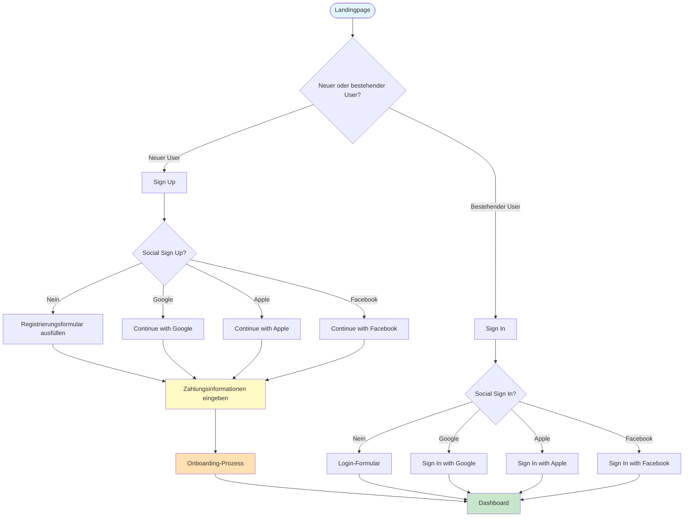

# User Flow

## Beispiele

### Text

Landingpage
├─> Sign Up
│ ├─> Social Sign Up?
│ │ ├─> Ja → Continue with Google/Apple/Facebook → Pay
│ │ └─> Nein → Fill Registration Form → Pay
│ └─> Pay → Onboarding
│ ├─> Welcome & Tour
│ ├─> Set Preferences
│ ├─> Connect Data/Integrations
│ └─> Complete Profile → Dashboard
│ ├─> Overview Metrics
│ ├─> Data Visualization
│ ├─> Manage Integrations
│ ├─> User Settings
│ └─> Support/Help
└─> Sign In → Dashboard

### Mermaid

## User Flow 1

**Als** registrierter Benutzer
**möchte ich** ein Team während eines laufenden Spiels bewerten können
**damit** ich am Gewinnspiel teilnehmen und meine Fachkenntnisse unter Beweis stellen kann.

### Akzeptanzkriterien

- Benutzer kann nur während der aktiven Spielzeit und bis eine Stunde nach Spielende Bewertungen abgeben
- Pro Spiel kann jedes Team nur einmal bewertet werden
- Alle 5 Kriterien müssen mit Werten zwischen 0-10 bewertet werden
- Das System berechnet automatisch die Differenz zum Durchschnitt
- Nach Bewertungsende wird die Position im Ranking angezeigt

### Technische Anforderungen

- Echtzeit-Validierung der Bewertungseingaben
- Automatische Sperrung des Bewertungssystems eine Stunde nach Spielende
- Berechnung und Speicherung der Durchschnittswerte in der Datenbank
- Implementierung des Ranking-Algorithmus gemäß definierter Regeln

### **User Story: Teambewertung**

**Als** registrierter Benutzer

**möchte ich** ein Team während eines laufenden Spiels bewerten können

**damit** ich am Gewinnspiel teilnehmen und meine Fachkenntnisse unter Beweis stellen kann.

---

### **Akzeptanzkriterien:**

1. **Zeitrahmen der Bewertung:**
   - Benutzer kann Bewertungen nur während der aktiven Spielzeit und bis eine Stunde nach Spielende abgeben.
   - System zeigt an, ob Bewertungen möglich sind (z. B. "Bewertungen aktuell geschlossen").
2. **Eindeutigkeit der Bewertung:**
   - Pro Spiel kann jedes Team nur einmal bewertet werden.
   - System validiert, ob bereits eine Bewertung für das Team abgegeben wurde.
3. **Bewertungsskala und Kriterien:**
   - Fünf Kriterien müssen mit Werten zwischen 0 und 10 bewertet werden.
   - Alle Kriterien müssen ausgefüllt sein, um die Bewertung abschließen zu können.
   - **Darstellung der Bewertungen in einem Radar Chart:**
     - Nach Abschluss der Bewertung wird ein Radar Chart angezeigt, das die fünf Kriterien (z. B. Stärke, Strategie, Technik) des Teams grafisch darstellt.
     - Das Radar Chart zeigt die individuellen Bewertungen des Benutzers sowie den Durchschnittswert aller Benutzer.
   - **Dynamisches Update:**
     - Während der Benutzer die Werte der fünf Kriterien eingibt, wird das Radar Chart in Echtzeit aktualisiert, um das aktuelle Ergebnis widerzuspiegeln.
4. **Automatische Berechnungen:**
   - System berechnet die Differenz jeder Bewertung zum Durchschnittswert aller Bewertungen in Echtzeit.
   - Ergebnisse werden dem Benutzer nach der Abgabe angezeigt.
5. **Ranking-Anzeige:**
   - Nach Ablauf der Bewertungszeit wird die Position des Benutzers im Ranking angezeigt.
   - Rankings basieren auf vorgegebenen Regeln, z. B. Gesamtpunktzahl oder Abweichung vom Durchschnitt.

---

### **Technische Anforderungen:**

1. **Echtzeit-Validierung:**
   - Eingaben der Benutzer (0–10) müssen sofort validiert werden.
   - Fehlermeldungen bei ungültigen Werten oder fehlenden Eingaben.
2. **Zeitsensitive Sperrung:**
   - Bewertungssystem wird automatisch eine Stunde nach Spielende gesperrt.
   - Sperrstatus wird dynamisch aktualisiert und Benutzer klar kommuniziert.
3. **Datenbank-Anforderungen:**
   - Durchschnittswerte aller Bewertungen werden in der Datenbank gespeichert.
   - Individuelle Bewertungen und Abweichungen werden mit Benutzer- und Spiel-ID verknüpft.
4. **Ranking-Algorithmus:**
   - Ranking wird gemäß vordefinierten Regeln (z. B. minimale Abweichung) berechnet.
   - Algorithmus muss skalierbar sein, um große Datenmengen zu bewältigen.

---

### **Zusätzliche Überlegungen:**

- **Frontend/UI:**
  - Klar verständliche Oberfläche mit Bewertungsskala (z. B. Schieberegler für Werte von 0 bis 10).
  - Fortschrittsanzeige für ausgefüllte Kriterien.
  - Visuelle Hinweise, wenn Bewertungen nicht mehr möglich sind.
- **Benachrichtigungen:**
  - Erinnerungen an Benutzer vor Spielende, um Bewertungen abzugeben.
  - Push-Nachricht oder E-Mail mit der endgültigen Platzierung im Ranking.
- **Sicherheit:**
  - Verifizierung, dass nur registrierte Benutzer Zugriff auf das Bewertungssystem haben.
  - Schutz gegen mehrfaches Bewerten eines Teams.

## User Story Map

| **Aktivitäten** | **Spiel auswählen**                    | **Team auswählen**                           | **Bewertung abgeben**                    | **Ergebnis anzeigen**            |
| --------------- | -------------------------------------- | -------------------------------------------- | ---------------------------------------- | -------------------------------- |
| **Schritte**    | - Liste der Spiele anzeigen            | - Teams des Spiels anzeigen                  | - 5 Kriterien bewerten                   | - Ranking anzeigen               |
|                 | - Bewertung offen/geschlossen anzeigen | - Überprüfen, ob Team bereits bewertet wurde | - Differenzen zum Durchschnitt berechnen | - Abweichungen anzeigen          |
|                 | - Spiel auswählen                      | - Team auswählen                             | - Bewertung absenden                     | - Statistik anzeigen             |
| **Details**     | - API: Aktive Spiele abrufen           | - Datenbank: Teams verknüpfen                | - UI: Echtzeit-Validierung der Eingaben  | - Ranking-Algorithmus berechnen  |
|                 | - Datenbank: Spielzeiten speichern     | - API: Bewertungsstatus prüfen               | - Dynamisches Radar Chart anzeigen       | - Ranking speichern und anzeigen |
